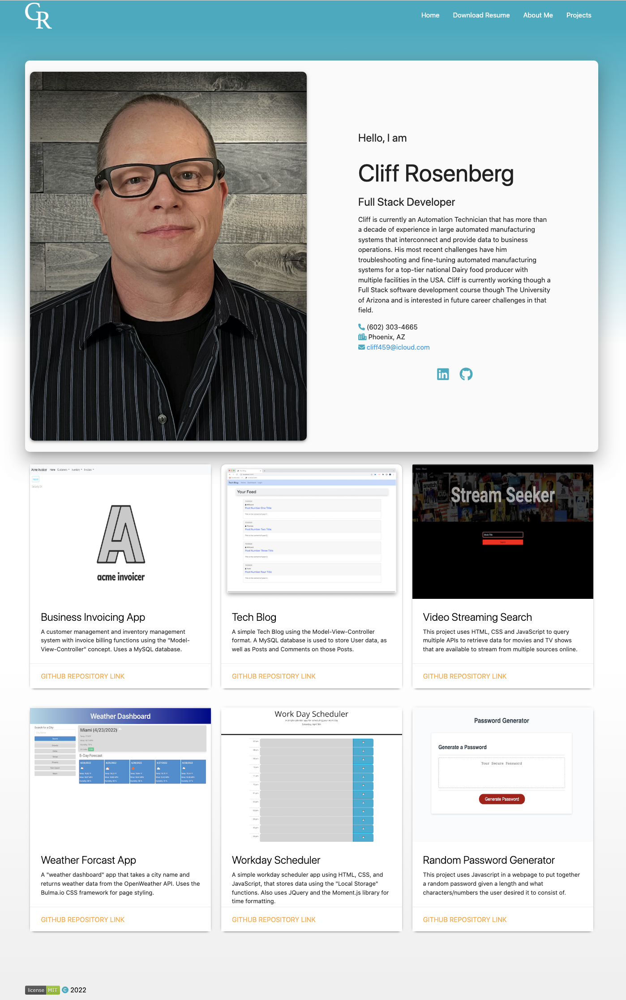

# 16-Portfolio-Updated

## Table of Contents-
- [Web Portfolio Update](#web-portfolio-update)
  - [Table of Contents-](#table-of-contents-)
  - [Licensing](#licensing)
  - [Description](#description)
  - [Installation](#installation)
  - [Screenshots](#screenshots)
  - [Usage](#usage)
  - [Credits](#credits)
  - [Contributing](#contributing)
  - [Testing](#testing)
  - [Additional Info](#additional-info)

## Licensing

Link: [MIT License](https://opensource.org/licenses/MIT)

## Description

This is an update to my web portfolio, with added recent projects and a total "ground-up" rebuild using the "Materialize CSS" framework. It is a responsive and "mobile friendly" design.

## Installation

No install is needed, the page is hosted here in Github Pages:

[https://cliff-rosenberg.github.io/16-Portfolio-Update-3/](https://cliff-rosenberg.github.io/16-Portfolio-Update-3/)

## Screenshots

## Usage

Launch page from Github Pages: [https://cliff-rosenberg.github.io/16-Portfolio-Update-3/](https://cliff-rosenberg.github.io/16-Portfolio-Update-3/)

## Credits

The page was developed utilizing the following CSS tools:

[Materialize CSS](https://materializecss.github.io/materialize/)

[Font Awesome icon toolkit](https://fontawesome.com/)

[Google Fonts - Material Icons](https://developers.google.com/fonts/docs/material_icons)

[JQuery library](https://jquery.com/)

## Contributing

  [Contributor Covenant](https://www.contributor-covenant.org/)

## Testing

  No testing is provided.

## Additional Info

- Github: [cliff-rosenberg](https://github.com/cliff-rosenberg)
- Email: cliff459 AT icloud.com